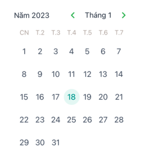

# react-native-select-date-orenda

HN

## Installation

```sh
1.Download package with npm or yarn

npm install react-native-select-date-orenda

yarn add react-native-select-date-orenda

2. Install

yarn add react-native-calendars 

```
## Modal




## Usage

```js
import React, { useState } from 'react'
import { Button } from 'react-native'
import {  SelectDate,utils } from 'react-native-select-date-orenda';

export default function App() {
  const [date,setDate]=useState('18/01/2023')
  const [isVisible, setIsVisible] = useState(false)

  return (
    <>
     
      <SelectDate
        valuePicker={date && utils.convertDigitInDate(date)}
        isVisiblePick={isVisible}
        onPressValue={(date) => {
          setDate(date)
        }}
      />
      <Button title="Open" onPress={() => setIsVisible(true)} />
      <Button title="Close" onPress={() => setIsVisible(false)} />
       
    </>
  );
}

```

## Props

| Prop                    |    Type  | Description                                                                 |Required|
|-------------------------|----------|-----------------------------------------------------------------------------|--------|
|`valuePicker`            | string   | The currently selected date. <br/> Example: `18/01/2023`                    |  Yes   |
|`maxDate`                | string   |  Maximum selectable date.    <br/> Example: `24/01/2023`                    |No      |
|`minDate`                | string   |  Minimum selectable date.    <br/> Example: `10/01/2023`                    |No      |
|`hideYear`               | boolean  |  If true, hide select Year                                                  |No      |
|`hideMonth`              | boolean  |  If true, hide select month                                                 |No      |
|`isVisiblePick`          | boolean  |  Boolean indicating if modal should be open.                                |Yes     |
|`convertDigitInDate`     | function | convert date input.                                                         |No      |


## Contributing

See the [contributing guide](CONTRIBUTING.md) to learn how to contribute to the repository and the development workflow.

## License

MIT

---

Made with [create-react-native-library](https://github.com/callstack/react-native-builder-bob)
